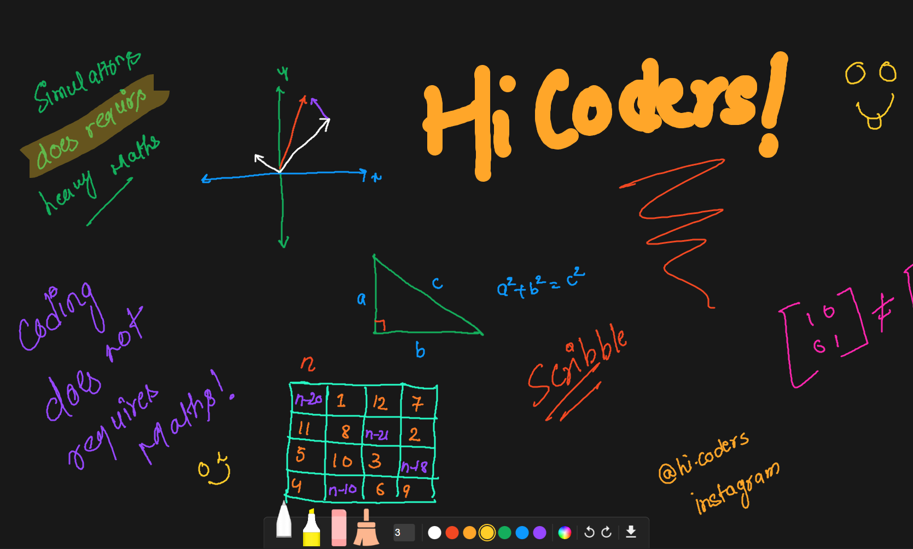

# Drawing Tablet



A simple and fast way to implement scribble in your projects!

## CND

```js
<script src="https://cdn.jsdelivr.net/gh/hicodersofficial/drawing-tablet@main/lib/DrawingTablet.min.js"></script>
```

## Getting Started

This will provide 600x600 canvas with drawing pad with functionality like `undo (Ctrl + Z)`, `redo (Ctrl + Y)`, `download (Ctrl + E)`, autosave and, `save (Ctrl + S)`

```js
const dt = new DrawingTablet();
```

```js
const dt = new DrawingTablet("#canvas-container", {
  logs: true, // default: false
  fullscreen: true, // default: false
  brushSize: 5, //default: 2
  bg: "#ffffff",
  autosave: true, // default: true
});
```

**Setter Methods**

```
dt.bg = "color"
dt.brushSize = number
dt.brushColor = "color"
```

**Getter Methods**

```
dt.brushColor
dt.brushSize
dt.opts
dt.ctx
dt.canvas
```

**Public Method**

```
dt.pencil()
dt.highlighter()
dt.eraser()

dt.log(message)
dt.redraw()
dt.clearOnlyScreen()
dt.clear()
dt.undo()
dt.redo()
dt.save()
dt.clearSaved()
dt.drawFromSaved()
dt.download(filename?)
```

### Example

```js
dt.pencil();
dt.brushSize = 20;
dt.brushColor = "#ffcd29";
```

```js
dt.highlighter();
dt.brushColor = "#ffcd29";
```

```js
dt.eraser();
```

### [See Live Preview](https://drawingtablet.netlify.app)
